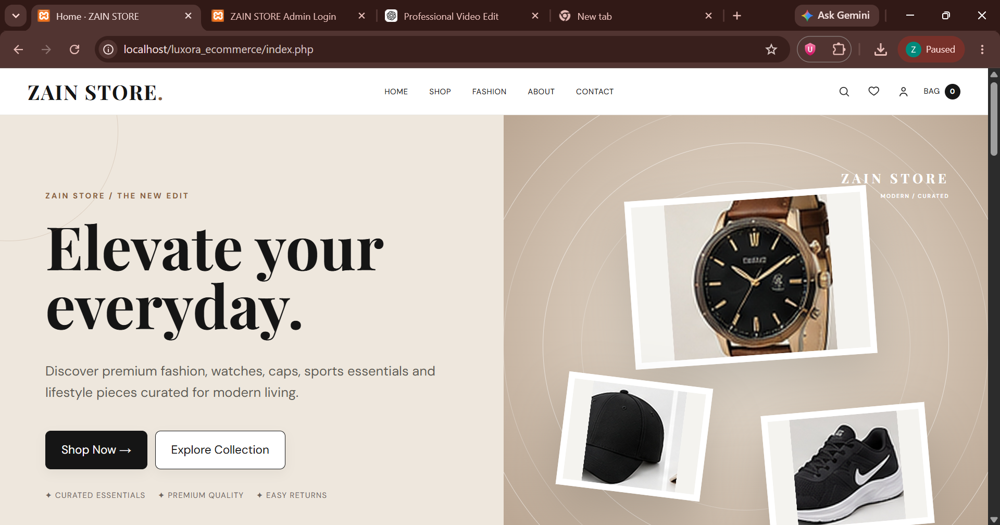
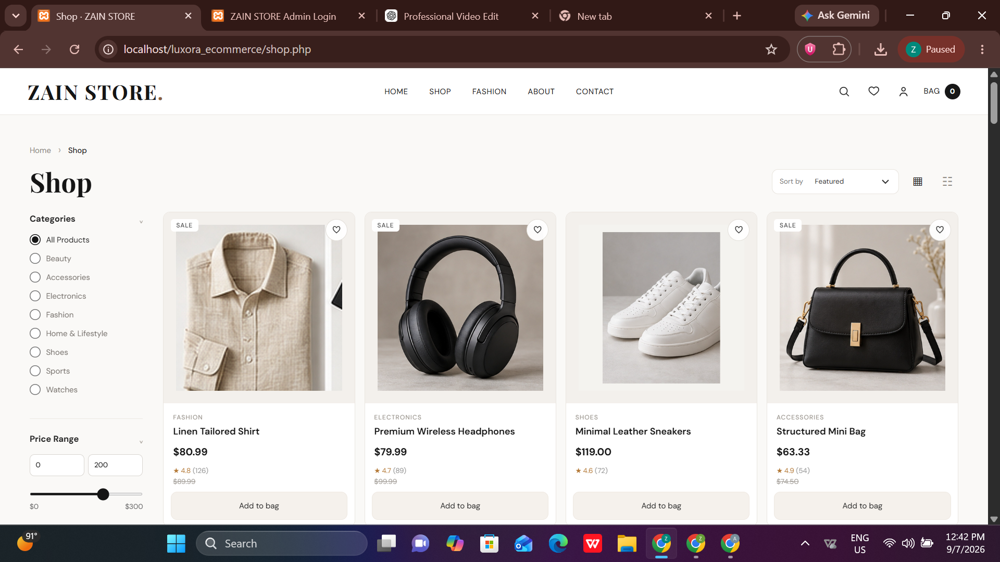
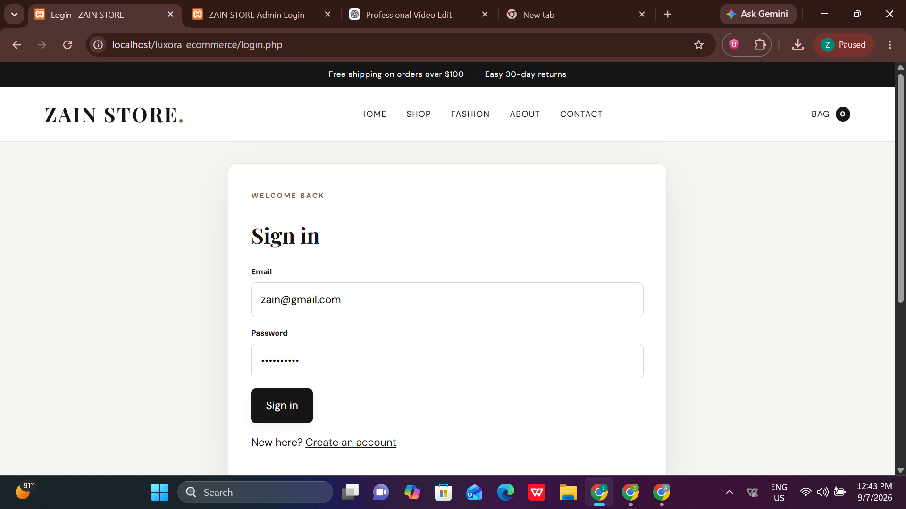
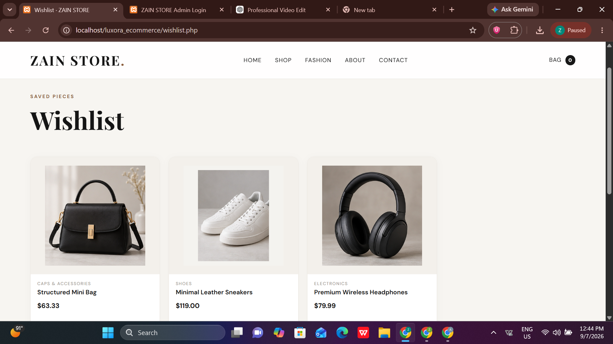
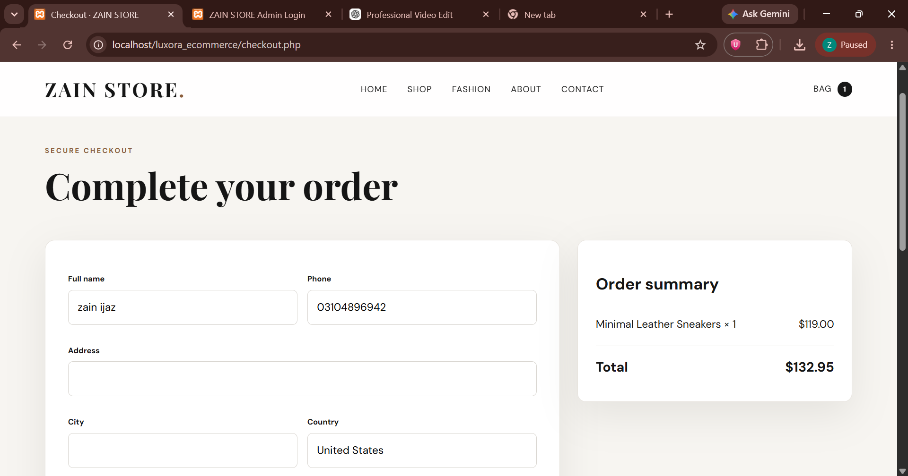
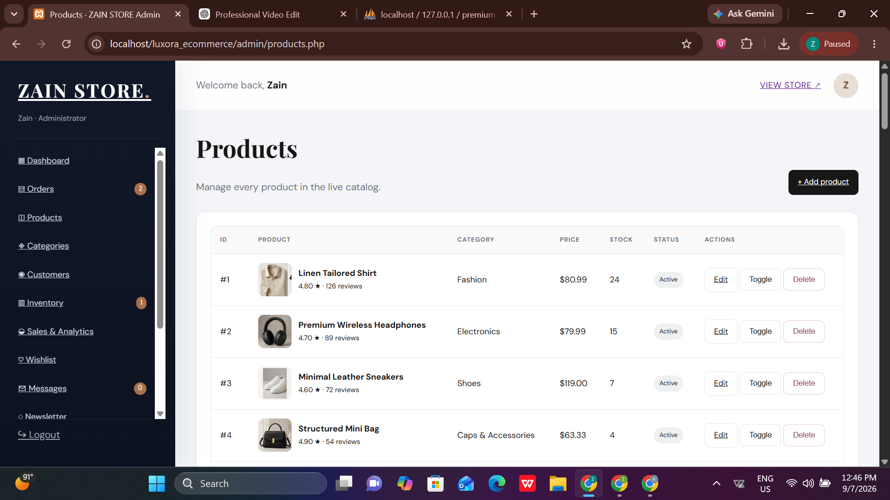

# Luxora Store

A modern full-stack e-commerce platform built with PHP, MySQL, HTML, CSS, and vanilla JavaScript, featuring a responsive storefront and a comprehensive administration system.

## Overview

**Luxora Store** is a PHP/MySQL-based e-commerce web application designed to provide a complete online shopping experience with customer account management, product discovery, shopping cart, wishlist, checkout, order tracking, and an administrative dashboard.

The project includes a responsive customer-facing storefront as well as a role-based admin panel for managing products, categories, customers, orders, inventory, promotions, website content, messages, newsletter subscribers, and store settings.

The application is designed to run locally using **XAMPP** with **Apache, PHP, and MySQL**.

---

## Features

### Customer Storefront

- Responsive homepage and storefront
- Product browsing and product detail pages
- Product categories
- Product search
- Category filtering
- Price range filtering
- Rating filtering
- In-stock filtering
- On-sale filtering
- Product sorting
- Discounted product pricing
- Product ratings and review counts
- Shopping cart
- Guest cart support
- Wishlist
- Customer registration and login
- Customer account page
- Order history
- Order confirmation
- Checkout system
- Shipping information
- Order summary
- Cash on Delivery option
- Credit/Debit Card demo option
- PayPal placeholder option
- Contact form
- Newsletter subscription
- About page
- Responsive navigation and layouts

### Shopping Cart

The cart system supports both guest and authenticated customers.

Authenticated users have their cart stored in MySQL, while guest cart items are maintained through PHP sessions.

Cart functionality includes:

- Add products
- Update quantities
- Remove products
- Stock-aware quantity handling
- Automatic discounted pricing
- Cart totals
- Checkout summary

### Wishlist

Customers can save products to their wishlist and manage their saved products.

The admin panel also provides wishlist analytics showing the most-wishlisted products.

---

## Admin Dashboard

The project includes a dedicated `/admin/` administration panel protected by role-based access control.

### Dashboard

The admin dashboard provides an overview of store activity, including:

- Total revenue
- Total orders
- Pending orders
- Processing orders
- Shipped orders
- Delivered orders
- Cancelled orders
- Total products
- Active products
- Out-of-stock products
- Low-stock products
- Customers
- Administrators
- Wishlist items
- Unread contact messages
- Daily sales snapshot
- Seven-day sales summary
- Monthly sales summary
- Top-selling products
- Recent orders
- Recent customers

### Product Management

Administrators can:

- Add products
- Edit products
- Delete products
- Activate/deactivate products
- Assign categories
- Set prices
- Apply discounts
- Manage stock
- Set product ratings
- Set review counts
- Configure product image paths

### Category Management

Administrators can:

- Create categories
- Edit categories
- Delete unused categories
- Add category descriptions
- View product counts by category

### Order Management

The admin order system provides:

- Order listing
- Order details
- Customer information
- Shipping information
- Ordered products
- Payment information
- Order totals
- Order status management

Supported order statuses include:

- Pending
- Processing
- Shipped
- Delivered
- Cancelled

### Inventory Management

The inventory section provides stock visibility and identifies products that require attention based on the configured low-stock threshold.

### Sales & Analytics

The analytics dashboard calculates store performance from MySQL order data and provides:

- Revenue
- Order count
- Average order value
- Items sold
- Daily sales
- Product performance
- Category performance
- Custom date-range reporting

### Customer Management

Administrators can view customer accounts and customer-related order information.

### Admin User Management

The system supports multiple administrator accounts with:

- Admin creation
- Admin profile management
- Password changes
- Admin removal
- Role-based admin access

### Promotions

Administrators can manage homepage promotional content, including:

- Sale headline
- Sale percentage
- Promotional text
- Promotion activation
- Countdown end date/time

### Website Content

The admin panel includes website content management for configurable store content.

### Contact Messages

Submitted contact messages can be viewed from the admin panel, including message status information.

### Newsletter

The admin panel provides access to newsletter subscriber information.

### Store Settings

Administrators can configure:

- Store email
- Store phone
- Store address
- Currency
- Tax rate
- Shipping cost
- Low-stock threshold

Admin profile information can also be updated from the settings section.

---

## Technology Stack

| TechnologyPurpose  |                                     |
| ------------------ | ----------------------------------- |
| PHP 8+             | Server-side application logic       |
| MySQL              | Relational database                 |
| PDO                | Database access                     |
| HTML5              | Page structure                      |
| CSS3               | Responsive styling and UI           |
| Vanilla JavaScript | Client-side interactions            |
| PHP Sessions       | Authentication and guest cart state |
| XAMPP              | Local development environment       |
| Apache             | Local web server                    |

> **Note:** The project does not use React, Node.js, Laravel, or another frontend/backend framework.

---

## Project Structure

```text
luxora_ecommerce/
│
├── admin/
│   ├── admins.php
│   ├── analytics.php
│   ├── categories.php
│   ├── content.php
│   ├── customer-details.php
│   ├── customers.php
│   ├── index.php
│   ├── inventory.php
│   ├── login.php
│   ├── logout.php
│   ├── messages.php
│   ├── newsletter.php
│   ├── order-details.php
│   ├── orders.php
│   ├── products.php
│   ├── promotions.php
│   ├── settings.php
│   ├── wishlist.php
│   │
│   └── includes/
│       ├── footer.php
│       └── header.php
│
├── assets/
│   ├── css/
│   │   ├── admin.css
│   │   └── style.css
│   │
│   ├── js/
│   │   ├── admin.js
│   │   └── script.js
│   │
│   └── images/
│       ├── categories/
│       └── products/
│
├── config/
│   └── database.php
│
├── includes/
│   ├── auth.php
│   ├── footer.php
│   ├── header.php
│   └── navbar.php
│
├── about.php
├── account.php
├── cart.php
├── checkout.php
├── contact.php
├── database.sql
├── health.php
├── index.php
├── login.php
├── logout.php
├── newsletter.php
├── order-success.php
├── product.php
├── realistic_images_update.sql
├── shop.php
├── signup.php
├── wishlist.php
│
├── admin_upgrade.sql
└── README.md

```

---

## Database

Luxora Store uses **MySQL with PDO** for persistent application data.

The database schema includes the following tables:

- `users`
- `categories`
- `products`
- `orders`
- `order_items`
- `wishlist`
- `cart`
- `contact_messages`
- `newsletter_subscribers`
- `site_settings`

### Database Responsibilities

**Users**

Stores customer and administrator accounts, roles, account status, and authentication data.

**Categories**

Stores product categories and descriptions.

**Products**

Stores product information including:

- Name
- Description
- Category
- Price
- Discount
- Stock
- Rating
- Review count
- Product images
- Active/inactive status
- View count

**Orders**

Stores customer, shipping, payment, pricing, and order-status information.

**Order Items**

Stores the products associated with each order and preserves relevant product information at the time of purchase.

**Cart**

Stores authenticated customers' shopping cart items and quantities.

**Wishlist**

Stores products saved by authenticated customers.

**Contact Messages**

Stores messages submitted through the contact form.

**Newsletter Subscribers**

Stores newsletter subscriber email addresses.

**Site Settings**

Stores configurable store and promotional settings.

---

## Authentication & Security

The project implements PHP session-based authentication with role-based access control.

Implemented security-related mechanisms include:

- PHP sessions
- Customer authentication
- Admin authentication
- Role-based admin authorization
- Active/blocked account status
- Password hashing using PHP's `password_hash()`
- Password verification using `password_verify()`
- CSRF token generation and validation
- Prepared PDO statements
- HTML escaping using `htmlspecialchars()`
- Stock validation during checkout
- Database transactions during order creation
- Row locking during checkout stock verification

The checkout process validates stock again before creating an order and updating product inventory.

### Production Security Considerations

Before deploying publicly, the following should be configured appropriately:

- Change the seeded administrator password
- Use HTTPS
- Configure secure session and cookie settings
- Use production database credentials securely
- Replace demo payment options with a real payment gateway
- Review server and PHP production configuration
- Keep credentials and environment-specific configuration outside version control

---

## Installation & Setup

### Requirements

Before running the project, install:

- XAMPP
- Apache
- MySQL
- PHP 8 or later
- A modern web browser

---

### 1. Install XAMPP

Install XAMPP on your system and open the **XAMPP Control Panel**.

Start:

```text
Apache
MySQL

```

---

### 2. Add the Project

Copy the project folder into the XAMPP web root:

```text
C:\xampp\htdocs\

```

The final structure should be:

```text
C:\xampp\htdocs\luxora_ecommerce\

```

---

### 3. Create the Database

Open:

```text
http://localhost/phpmyadmin/

```

The included `database.sql` file creates the required database:

```text
premium_store

```

Import:

```text
database.sql

```

into phpMyAdmin.

The SQL file creates the required tables and seeds the initial catalog and store settings.

---

### 4. Configure the Database Connection

The database connection is located at:

```text
config/database.php

```

The default local configuration uses:

```php
$host = 'localhost';
$db   = 'premium_store';
$user = 'root';
$pass = '';

```

Update these values if your local MySQL configuration is different.

Do not commit real production credentials to the repository.

---

### 5. Run the Application

Open:

```text
http://localhost/luxora_ecommerce/

```

The Luxora Store storefront should now be available.

---

## Admin Panel

The admin panel is available at:

```text
http://localhost/luxora_ecommerce/admin/

```

### Demo Admin Account

The included database contains a seeded administrator account for local development.

```text
Email: admin@luxora.test
Password: Admin@123

```

**Important:** Change the default administrator password before any real deployment.

---

## Existing Database Migration

If an earlier Luxora database already exists, do **not** import `database.sql`, because it is intended for a fresh database installation.

For existing installations, the project includes migration/update SQL files such as:

```text
admin_upgrade.sql
realistic_images_update.sql

```

`realistic_images_update.sql` updates product image paths without dropping the existing database structure or removing customer/order data.

---

## How to Use

### Customer Workflow

1. Open the Luxora Store homepage.
2. Browse products or categories.
3. Use search and product filters.
4. Open individual product details.
5. Add products to the cart.
6. Save products to the wishlist when signed in.
7. Create an account or sign in.
8. Review the shopping cart.
9. Proceed to checkout.
10. Enter shipping information.
11. Select an available payment option.
12. Place the order.
13. View the order confirmation.
14. Review orders through the customer account.

### Admin Workflow

1. Open the admin panel.
2. Sign in with an administrator account.
3. Review dashboard statistics.
4. Manage products and categories.
5. Monitor inventory.
6. Review and manage customer orders.
7. Update order statuses.
8. Review customer information.
9. Analyze sales performance.
10. Manage promotions and website content.
11. Review contact messages and newsletter subscribers.
12. Configure store settings and administrator accounts.

---

## Payment Processing

The checkout interface currently supports:

- Cash on Delivery
- Credit/Debit Card **demo UI**
- PayPal **placeholder**

The project does **not** implement a live card processor or PayPal API integration.

The card option records the order as paid for demonstration purposes, while Cash on Delivery and PayPal placeholder orders remain pending.

For a real deployment, integrate a secure payment provider rather than handling payment credentials directly inside the application.

---

## Screenshots & Demo

The following screenshots showcase the main customer-facing and administrative interfaces of Luxora Store.

### Homepage

The homepage presents the store's modern storefront, featured products, curated collections, promotional messaging, and primary shopping navigation.



### Shop

The shop interface provides product browsing with categories, price filtering, sorting, sale indicators, ratings, wishlist actions, and add-to-bag functionality.



### Checkout

The checkout page provides customer and shipping information fields alongside an order summary for completing purchases.



### Wishlist

The wishlist allows customers to save and review products for future purchases.



### Customer Login

The login interface provides customer authentication and account access.



### Admin Product Management

The admin product management interface allows administrators to manage the live product catalog, including product information, categories, pricing, inventory, status, editing, and deletion.



> **Note:** Place the corresponding screenshots inside a `screenshots/` directory in the repository using the filenames referenced above.

---

## Project Highlights

- Full-stack PHP/MySQL e-commerce implementation
- Responsive customer storefront
- Dedicated administrative dashboard
- Role-based customer/admin access
- Product and category management
- Shopping cart with guest and authenticated-user support
- Wishlist functionality
- Order and inventory management
- MySQL-backed sales analytics
- Promotional content management
- Customer and newsletter management
- CSRF protection
- Password hashing
- PDO prepared statements
- Transaction-based checkout
- Stock validation and inventory updates
- Local product and category imagery
- XAMPP-friendly local development setup

---

## Future Improvements

Potential improvements for future versions include:

- Integration with a production payment gateway
- Email notifications for orders and account activity
- Product review submission and management
- Advanced customer order tracking
- Image upload management from the admin panel
- More advanced reporting and analytics
- Automated database configuration through environment variables
- Production deployment configuration
- Automated testing
- Additional security hardening for public deployment

---

## Learning & Development Purpose

Luxora Store demonstrates practical full-stack web development using traditional server-side PHP and MySQL.

The project covers core concepts including:

- CRUD operations
- Relational database design
- Authentication and authorization
- Session management
- Form processing
- Secure database queries
- Shopping cart logic
- Wishlist management
- Order processing
- Inventory management
- Admin dashboard development
- Sales reporting
- Responsive frontend development
- JavaScript-based interface interactions
- Secure checkout workflows

It is suitable as a portfolio project demonstrating the development of a complete database-driven e-commerce application without relying on a frontend framework.

---

## Author

**Zain Ijaz**

Full-Stack Web Developer

---

## License

This project currently does not include a dedicated open-source license.

If the project is intended for public distribution or commercial use, add an appropriate license to the repository.